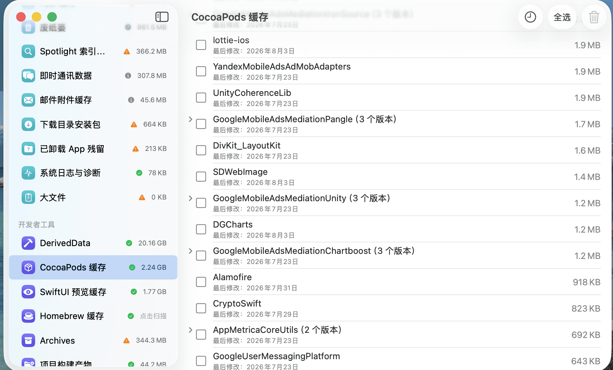

# Cleanly
A lightweight macOS cleanup utility to free disk space by removing caches, logs, Xcode data, simulator files, and other unnecessary system files.

## Features

- Cache Cleanup
- Log Cleanup
- Xcode Cleanup
- Simulator Cleanup
- Homebrew Cleanup

## Screenshots

## Installation

Download the latest release.

## Requirements

macOS 14+

## License

MIT
